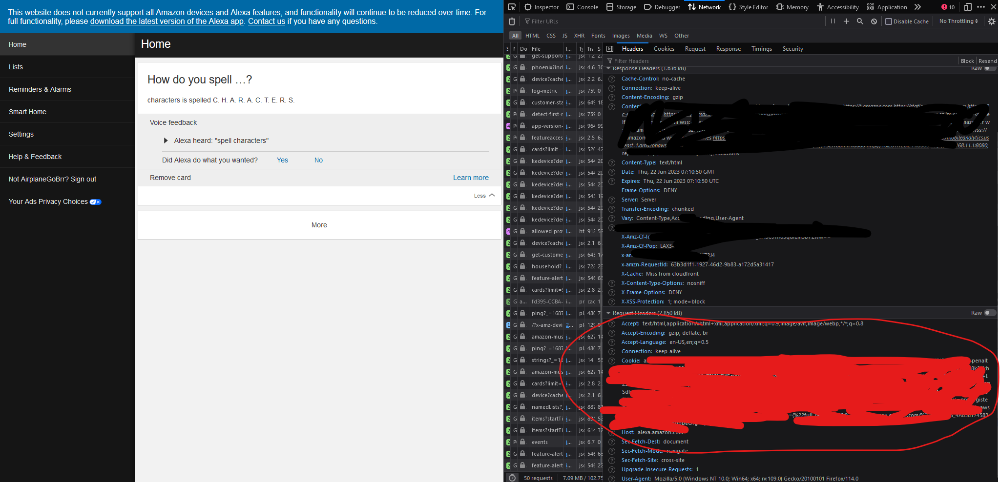

# alexa-smart-plug-API

(Some code was taken from MeemeeLab [project](https://github.com/MeemeeLab/alexa-smart-plug))

## What is this

This is a simple alexa smart plug controller

You can turn on and off your smart plugs

As well as get the current status!

## How to use

1. Import and setup the module
```js
const SmartPlugBuilder = require("./smartplug")
const smartplug = new SmartPlugBuilder(cookies, domain);
```

2. Get your alexa cookies
You can do this by going to the alexa website `https://alexa.amazon.com/spa/index.html` open devtools and goto the networking tab and refresh your page and you will see the cookie box, copy that and goto a URL decoder and decode the string and then put it back in the code




3. Put all the cookie info as the first arg and your amazon URL as the 2ed arg (not sure? just put `amazon.com` ) make sure to remove any subdomains or paths from the domain

4. Have fun
```js
const SmartPlugBuilder = require("./smartplug")
const { cookies, domain } = require("./config")
const smartplug = new SmartPlugBuilder(cookies, domain);

(async ()=>{
    const devices = await smartplug.getAllDevices()
    await smartplug.setState(devices[0].id, true)

    let state = await smartplug.getState(devices[0].id)
    console.log(state) // Output: true (the light is on!)

    await smartplug.setState(devices[0].id, false)

    let state = await smartplug.getState(devices[0].id)
    console.log(state) // Output: false (the light is off!)
})();
```