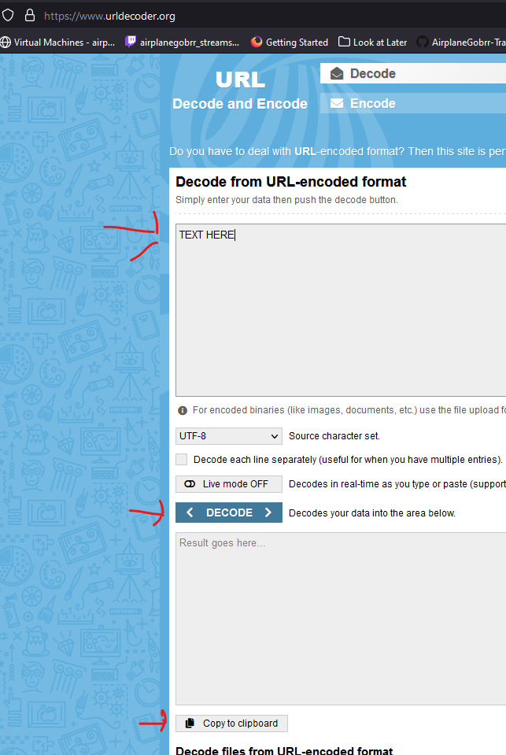

# alexa-smart-plug-API

(Most* code was taken from MeemeeLab [project](https://github.com/MeemeeLab/alexa-smart-plug), huge shout out to them for their work!)

## What is this

This is a simple alexa smart plug controller.

You can turn on and off your smart plugs.

As well as get the current status!

## How to use

1. Import and setup the module
```js
const SmartPlugBuilder = require("./smartplug")
const smartplug = new SmartPlugBuilder(cookies, domain);
```

2. Get your alexa cookies, Amazon has removed the Alexa website (Thanks, Amazon.) So you have to use an API route to get it, I would use [https://alexa.amazon.com/api/phoenix](https://alexa.amazon.com/api/phoenix) the next steps are all the same.

Also there is a step talking about using a URL decoder- that can be ignored as this module will decode the cookie string for you.

**Keep in mind, cookies do expire! You will have to update your cookie string every so offen**

Note: if you have the `raw` option (like firefox does) enable it and copy the cookie, you can even include the `Cookie: ` part and the module will replace it for you.


The next step can be **ignored** as the module will decode it for you!



1. Put the whole cookie string as the first arg and your Amazon URL as the 2ed arg (not sure what url? just put `amazon.com` ) make sure to remove any subdomains or paths from the domain

2. Have fun
```js
const SmartPlugBuilder = require("./smartplug")
const { cookies, domain } = require("./config")
const smartplug = new SmartPlugBuilder(cookies, domain);

(async ()=>{
    const devices = await smartplug.getAllDevices()
    await smartplug.setState(devices[0].id, true)

    let state = await smartplug.getState(devices[0].id)
    console.log(state) // Output: true (the light is on!)

    await smartplug.setState(devices[0].id, false)

    let state = await smartplug.getState(devices[0].id)
    console.log(state) // Output: false (the light is off!)
})();
```

# List of Amazon domains

[https://gist.github.com/AminulBD/8c347539ecd49a8ab0b24544dd2ebab1](https://gist.github.com/AminulBD/8c347539ecd49a8ab0b24544dd2ebab1)

make sure its just the domain name, don't include `https://` or `www`

# Todo

-- N/A --